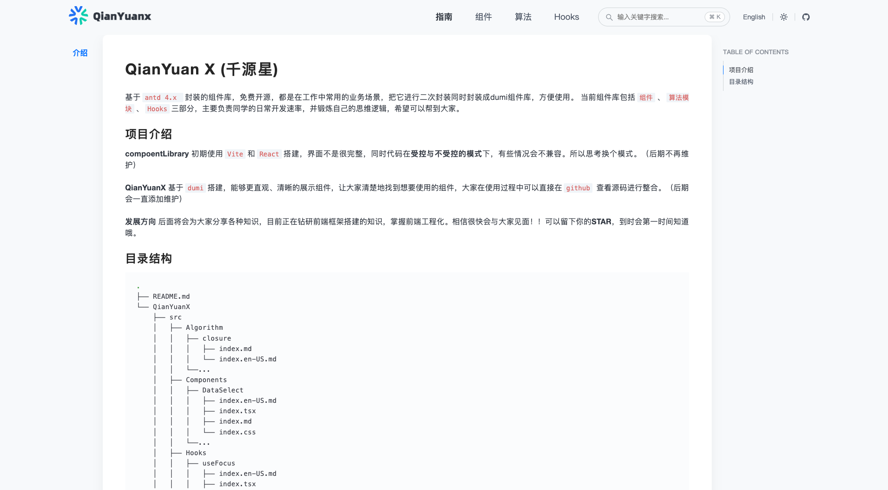

# QianYuan X (千源星)

基于`antd 4.x `封装的组件库，免费开源，都是在工作中常用的业务场景，把它进行二次封装同时封装成 dumi 组件库，方便使用。
当前组件库包括`组件`、`算法模块`、`Hooks`三部分，主要负责同学的日常开发速率，并锻炼自己的思维逻辑，希望可以帮到大家。

## 🔅 项目介绍

**compoentLibrary** 初期使用`Vite`和`React`搭建，界面不是很完整，同时代码在**受控与不受控的模式**下，有些情况会不兼容。所以思考换个模式。（后期不再维护）

**QianYuanX** 基于`dumi`搭建，能够更直观、清晰的展示组件，让大家清楚地找到想要使用的组件，大家在使用过程中可以直接在`github` 查看源码进行整合。（后期会一直添加维护）

**发展方向**
后面将会为大家分享各种知识，目前正在钻研前端框架搭建的知识，掌握前端工程化。相信很快会与大家见面！！可以留下你的**STAR**，到时会第一时间知道哦。

## 📖 目录结构

```bash
.
├── README.md
└── QianYuanX
    ├── src
    │   ├── Algorithm
    │   │   ├── closure
    │   │   │   ├── index.md
    │   │   │   └── index.en-US.md
    │   │   └──...
    │   ├── Components
    │   │   ├── DataSelect
    │   │   │   ├── index.en-US.md
    │   │   │   ├── index.tsx
    │   │   │   ├── index.md
    │   │   │   └── index.css
    │   │   └──...
    │   ├── Hooks
    │   │   ├── useFocus
    │   │   │   ├── index.en-US.md
    │   │   │   ├── index.tsx
    │   │   │   ├── index.md
    │   │   │   └── index.css
    │   │   └── ...
    │   └── index.ts
    ├── .dumirc.ts
    ├── .eslintrc.js
    ├── .gitignore
    ├── .prettierrc
    ├── package.json
    └── tsconfig.json

```

**📎 首页**


**📎 指南**



**📎 组件**


**📎 算法模块**


**📎 Hooks**


**💻 使用方法**  
之前发布到了`GitHub Packages`,但是经常出现修改源码的情况，所以将不在发布了包管理，大家在使用的时候可以复制代码到`untils`工具中，用到的时候可以直接复制代码，复制到项目中，可自行修改使用
